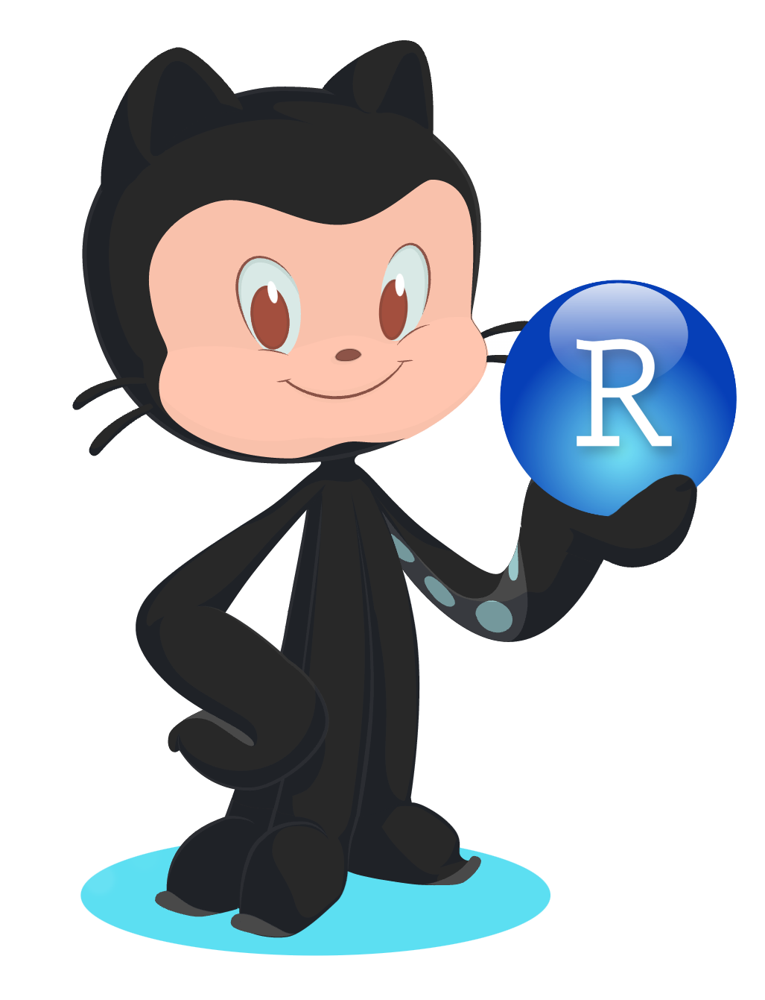

### Introduction to GitHub

  

This is the second in a series of FAIR workshops provided by the Trans-Divisional Research Program. This workshop will provide instruction and hands-on experience with using GitHub to support FAIR practices for epidemiology research.
        	Participants will receive an overview of GitHub and GitHub Desktop, including integrating RStudio with GitHub. Attendees will practice:
- 	Creating local and remote repositories
- 	Using GitHub versioning control to keep track of your programs
- 	Working with collaborators over GitHub

### Prerequisites
1) Install [R](https://cran.r-project.org/) and [RStudio](https://posit.co/downloads/) on their laptop
2) Have an active NIH Box account
3) Create a [GitHub account](https://github.com/)
4) Install [GitHub Desktop](https://docs.github.com/en/desktop/installing-and-configuring-github-desktop/installing-and-authenticating-to-github-desktop/installing-github-desktop)
5) [Authenticate](https://docs.github.com/en/desktop/installing-and-configuring-github-desktop/installing-and-authenticating-to-github-desktop/authenticating-to-github#authenticating-an-account-on-github-1) yourself on GitHub Desktop

For help with the workshop prerequisites, see this [help document](https://docs.google.com/document/d/1RBvmmkK1J0LUyeUyF5ADsUbSWlm9zdSHDiqzy2R7Who/edit), attend the [DCEG FAIR Friday meeting](https://episphere.github.io/fair/) for in person help scheduled every Friday, 11:00-12:00, and join us at the [DCEG FAIR chatroom](https://gitter.im/episphere/Fair) (just need your GitHub ID to log in 😉😉)

