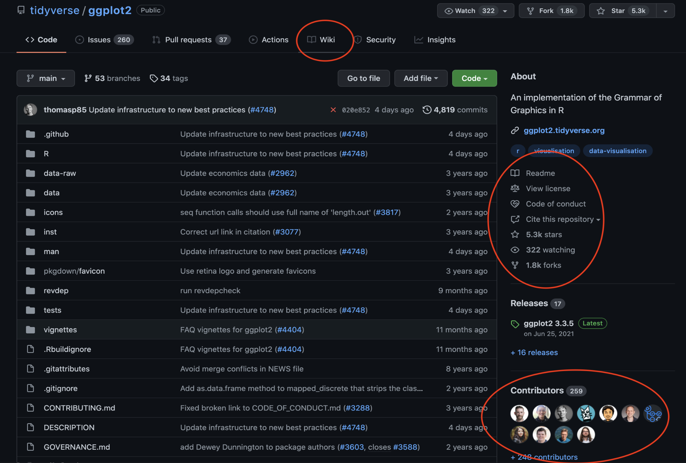

## Lecture slides

<iframe src="https://docs.google.com/presentation/d/e/2PACX-1vQ2m_PajbJCqTp5GnbMw7wYCZUf5ca8ez-sTgTMw5ylyRZEDL7f1uIZs3ltOHvw5mPtBWVIwED_Pyu1/embed" frameborder="0" width="960" height="569" allowfullscreen="true" mozallowfullscreen="true" webkitallowfullscreen="true"></iframe>

## Learning objectives

- Become conversant with the terms— Findable, Accessible, Interoperable, and Reusable (FAIR).
- Review how Box helped us adhere to the FAIR principles with respect to data.
- Learn how Git & GitHub can help us achieve FAIRness with respect to the code/software that we develop.
- Learn about resources within DCEG to discuss the FAIR principles, and the challenges of applying them to your bespoke research setting.

## Lecture notes

### Motivation

There are several motivations to make our research practices more FAIR—

- To make our research resources easy to share and be reused by our target audience (and ourselves), with appropriate credits for our contributions.
- To make our research findings reproducible and replicable.
  - *Reproducibility* is the ability to use the same data and the same code that you used, to obtain the same findings that you did.
  - *Replicability* is the ability to use the same code that you used but on a different yet related dataset, to obtain findings that are similar to yours.
- To make it easier to collaborate with others.
- To comply with data sharing policies of funding agencies and scientific journals.

### FAIR principles

  

In the following definitions, *users* can refer to both yourself and others who want to use or extend your work.

- **Findable**: users can locate your research resources (data, code, and the associated metadata) online.
   - This is best achieved when your resources are linked via URLs that are globally unique and persistent identifiers. 
   - Such a resource can then be found remotely on the internet from anywhere in the world.
- **Accessible**: your data and code can be securely accessed online by those users with appropriate permissions.
   - The word *governance* is perhaps more appropriate. Accessibility refers to your ability to govern your resources by controlling who can and who cannot access your resources.
   - You may want to govern each of your research resources differently. For example, you may want to share your code with everyone, but your data may need to be restricted to only those with certain permissions.
- **Interoperable**: users can integrate your data with other data sources and users can run your code on any compute system.
   - Interoperability is achieved by adhering to open standards. 
   - You can use open standard (non-proprietary) formats to describe your data, such as— CSV, JSON, XML, and RDF.
   - You can write code in open-source languages that are supported on a variety of compute systems (e.g., Windows, Mac, or Linux), such as— R, Python, and JavaScript.
- **Reusable**: users with permission can reuse your resources to reproduce your results and/or replicate your findings.
   - Reusability is achieved primarily by ensuring that your resources are Findable, Accessible, and Interoperable.

We shall now see how RStudio, Box, Git, and GitHub helps us adhere to these principles with ease.

### Box

[Box](https://www.box.com/) is a cloud-based data storage service and collaboration platform. It is a great tool to store and share your research data. 

[In the first workshop of the FAIR workshop series](https://dceg-workshops.github.io/fair_principles_for_data_stewardship/workshops/workshop_1), we showed how to incorporate Box within our RStudio work environment as shown in the diagram below. We remotely (from your computer to where Box is located on the internet) communicated with the Box service via [the R library `boxr`](https://cran.r-project.org/web/packages/boxr/vignettes/boxr.html).

  

The `boxr` library is built on top of the Box API. The Box API allows us to interact with Box programmatically. This means that we can write R scripts to upload our data on Box, retrieve it, modify it (while keeping track of all versions of the data), and/or selectively share it with others. We can also revoke access to our data from specific users at any time.

#### How does Box help achieve FAIRness?

We achieved FAIRness by using Box to store and share our research data and by using the `boxr` library to interact with Box. Specifically, we achieved FAIRness as follows—

- **Findable**: Box assigns a unique and persistent URL to each data object, and all its versions, stored there. Those with permissions can use this URL to access the data from anywhere in the world. In the first workshop, we programmatically accessed (from RStudio via `boxr`) a specific data object stored in Box, that we were granted permissions to, using the unique URL assigned to it by Box. In the figure below, we can see Box's web interface. The unique and persistent URLs assigned by Box to each data object (and its versions) are highlighted in red.

  

- **Accessible**: Box allows directory owners to control who can access their data objects. We can share our data with specific users, a group of users, or the entire world. We can also revoke access to our data from specific users at any time. We can grant users granular permissions to our data. For example, we can grant some users the ability to view our data, but not to modify them. In the first workshop, we used `boxr` to access only those files from Box that each of us had permissions for. In the figure below, we can see the parts of Box's web interface that allows us to control who can access our data.

  

- **Interoperable**: the data objects we store in Box should be in open standard formats, such as— CSV, JSON, XML, and RDF. We must not store the data objects in proprietary formats, such as— Microsoft Excel, Microsoft Word, or Adobe PDF— which would require the users to have the necessary license and specialized tools to read these formats. This creates a hurdle in interoperability because the users do not have a straightforward way to combine our data objects with elements from their data.
- **Reusable**: by ensuring that our data objects are Findable, Accessible, and Interoperable using Box, we ensured that our data is Reusable. This is because the users can now easily locate, access, and integrate our data objects with other data. This allows them to reproduce our results and/or replicate our findings.

### Git & GitHub

Let us start by distinguishing Git from GitHub.

#### Git

[Git](https://git-scm.com/) is a *local*, *version control system* software.

*Local* implies that the Git software exists within your computer. This can be any device you use for computing, for example— your NIH laptop, a Biowulf node, or a cloud virtual machine. You can download Git from [here](https://git-scm.com/downloads). In many Unix-based systems (e.g., Linux and Mac), Git comes pre-installed.

A *version control system* is a software that helps you keep track of the changes you make to your files in a directory. It is a great tool to keep track of the changes you make to your code.

There are multiple ways to access the Git software in your computer—
- The command line (Terminal for Mac, Command Prompt for Windows).
- A GUI (Graphical User Interface) software, such as— [GitKraken](https://www.gitkraken.com/), [GitHub Desktop](https://desktop.github.com/), or [SourceTree](https://www.sourcetreeapp.com/).
- An RStudio add-in. [See instructions here](https://happygitwithr.com/index.html).

For this workshop, we will use [GitHub Desktop](https://desktop.github.com/) to access the Git software in our computers. This is a GUI software developed by GitHub. Compared to the RStudio add-in, GitHub Desktop is more user-friendly and easier to use. Once you are comfortable using GitHub Desktop, you can switch to the RStudio add-in. The only hurdle in using the RStudio add-in is [the initial personal access token setup to communicate with GitHub](https://happygitwithr.com/https-pat.html). If you are comfortable with this step, feel free to immediately switch to the RStudio add-in as it gives you a more integrated development environment without having to rely on an additional piece of software like GitHub Desktop.

#### GitHub

[GitHub](https://github.com/) is a *collaborative networking* website that provides a service to *remotely* *host* and manage copies of your project directories. 

*Remote* implies that the GitHub website exists on the internet. You can access it from your computer either via a web browser or via the GitHub Desktop software.

*Collaborative networking* means that you can share your project directories with other users (or for yourself to re-visit the project in the future). This allows you to collaborate with other users. You can also share your project directories with the world. This allows other users to access your project directories and use them for their own projects. When you publish a paper, GitHub has become the de-facto standard platform for sharing the code used to generate the results in the paper.

*Hosting service* is a service to remotely store copies of your project directories. This allows you to access your project directories from anywhere in the world. You can access your project directories from your computer, from a cloud virtual machine, or from a Biowulf node.

There are other alternatives to GitHub, such as— [GitLab](https://about.gitlab.com/), and [BitBucket](https://bitbucket.org/). However, GitHub is the most popular and widely used platform for hosting your project directories. Once you are familiar with GitHub, you will become comfortable using these other platforms as well.

#### Integrating GitHub into our workflow

In this workshop, we will integrate GitHub with our existing RStudio-Box workflow from the first workshop, as shown in the diagram below. We will store our research code on GitHub by remotely communicating with the GitHub service via the GitHub Desktop software. Here, GitHub Desktop assumes a similar role to `boxr`, used to communicate with Box, in the first workshop.

  

This setup can be considered as a minimalistic *data commons*. [Data commons "co-locates data with cloud computing infrastructure and commonly used software services, tools & applications for managing, analyzing and sharing data to create an interoperable resource for a research community"](https://medium.com/@rgrossman1/a-proposed-end-to-end-principle-for-data-commons-5872f2fa8a47). In our version of the data commons, we bring our own compute (e.g. our laptop) instead of utilizing cloud compute resources. Both the data and the code exists in the cloud, and they are Findable, Accessible, and Interoperable thanks to Box and GitHub.

We can immediately see the benefits of this setup. It gives us a flexible framework to plug-and-play with different datasets, while evaluating the same code (i.e. *replicating* studies). It also allows us to plug-and-play with different code solutions for the same problem (i.e. *benchmarking*). For *reproducing* a specific study, we simply need to locate and access a specific data object from Box and the specific code from GitHub.

#### Why can’t I put my code in Box?

The main reasons why Box is not a suitable platform to store your code are—
- Box and GitHub are designed for different purposes. 
  - Box is a file storage service, while GitHub is a programming-aware, collaborative code hosting service. 
  - This is the same reason why you wouldn't use MS Word to write R code. MS Word is a genera-purpose text editor, while RStudio is an integrated development environment (IDE) specially designed for R. RStudio has features that shows a *programming-awareness* of the R programming language, such as— [syntax highlighting](https://en.wikipedia.org/wiki/Syntax_highlighting), [code completion](https://en.wikipedia.org/wiki/Intelligent_code_completion), and [code folding](https://en.wikipedia.org/wiki/Code_folding). These features are not available in MS Word, making it an unsuitable candidate for writing code.
  - GitHub also shows programming-awareness by providing features, such as— syntax highlighting for a plethora of programming languages, ability to search for projects only written in a specific programming language, and support to display special file formats like Jupyter notebooks.
  - GitHub also provides features for code management, such as— [code review](https://en.wikipedia.org/wiki/Code_review), [issue tracking](https://en.wikipedia.org/wiki/Issue_tracking_system), and [pull requests](https://en.wikipedia.org/wiki/Pull_request). These features are not available in Box.
- Box and GitHub use different types of version control.
  - Box uses a *file-based* version control system. This means that Box keeps track of the changes you make to individual files. This is similar to how you would keep track of the changes you make to your Word document.
  - GitHub tracks changes to the whole project directory. This is because programming a single concept in our source code often involves making changes to multiple files in the directory.
- Data's metadata is different from code's metadata.
  - The data's metadata often includes information like the data format, data source, the date the data was collected, the date the data was last modified, the date the data was last accessed, the date the data was last used in a publication, etc. Box provides many of these features.
  - The code's metadata includes the README file, the license, the version number, the Wiki, usage statistics, project contributors, information on how to cite the software, etc. GitHub can provide all this information whilst integrating it seamlessly with the source code.
- The developer community
  - GitHub has grown to become a hub for developers across the world. This has developed a community of developers who use, reuse, provide help to other developers, and are looking to contribute to various projects. Such a community does not exist in Box. Box is not meant to be a networking website.
- GitHub Pages 
  - GitHub provides a service to host static websites for free. This is a great way to share your research results with the world. This is not possible in Box.
  - This website is co-located with your source code. This effectively makes GitHub a one shop-stop for all your research needs. You can share your research results, your source code, and some demo data all in one place. 
  - You can also use GitHub Pages to host your personal website. 
- Increasingly, funding agencies and research journals are requiring researchers to share their code on GitHub.

#### Why can't I put my data on GitHub?

You absolutely can! A stellar example came during the outbreak of the COVID-19 pandemic. Johns Hopkins University developed a resource to track COVID cases, recoveries, and deaths. [They shared this data on GitHub](https://github.com/CSSEGISandData/COVID-19). At that time, there was no other resource in the US to monitor the pandemic. This resource allowed a proliferation of many public health tools that used this data to generate insights. The COVID app diaplayed by the Google search engine also used this data.

However, GitHub is ideally suited to host data that you want to make public. If you want to host data that you want to keep provate or provide controlled access to only a few people, GitHub is not a suitable option to host such a data.

There are another couple of points to remember—
- GitHub is not a data storage service. It is a code hosting service. 
  - GitHub is not designed to store large datasets. GitHub has a limit on the size of the files you can upload. This limit is 100 MB. This is not a problem for most research data. However, if you have a large dataset, you will need to use a different service to host your data.
  - Your NIH Box account has a individual file size limit of 150 GB. However, there is no limit to the number of files you can store on Box.
- GitHub is not a data management service. It lacks the granular permissions provided by Box.
  - GitHub does not provide a way to share a specific file or a sub-folder with a specific person. You can only share the entire repository with the person. This is not a problem if you want to share your entire project with this person. However, if you only want to share a specific file, you should prefer Box to host and share your data.
  - Box also provides granular permissions such as only allowing the user to view the files but not modify it. This is again preferable for data hosting.

#### How does Git & GitHub help achieve FAIRness?

Git & GitHub help us achieve FAIRness in the following ways—

- **Findable**: GitHub assigns a unique and persistent URL for each software project source code (and its versions) that we store there. Both the code and the metadata is co-located at the URL. GitHub allows us to locate a specific version of our code, using the URL GitHub assigns to it, using either the browser or GitHub Desktop. The figure below shows the GitHub web interface for a popular R library `ggplot2`. The unique URL assigned by GitHub to this project is: [https://github.com/tidyverse/ggplot2](https://github.com/tidyverse/ggplot2).

  

- **Accessible**: GitHub allows project owners to control who can access our code. We can share our code with specific users, a group of users, or the world. We can also revoke access to our code from specific users at any time. Those with permissions can securely access our code. The figure below shows the GitHub Desktop interface for assigning permissions for a specific project. Here, the project owner has chosen to keep the project private for now. They may later make this project public if they are ready to share it with the world.

  

- **Interoperable**: the software we develop should be written using open-source languages, such as— R, Python, and JavaScript. We must not use proprietary languages, such as— MATLAB, SAS, and Stata— which would require our users to have the necessary license to run our code. Our software development environment should also be open-source, such as— RStudio. RStudio allows the users to run your code on any major operating system— Windows, Mac, and Linux.
- **Reusable**: by ensuring that our code is Findable, Accessible, and Interoperable using GitHub, we ensure that our code is Reusable. This is because the users can now easily locate, access, and run our code. This allows them to reproduce our results and/or replicate our findings.

#### Code metadata

Code metadata is different from the metadata associated with data. Code metadata provides us with important information about the code. Code metadata includes—

- **README file**: a plain text or markdown file that describes everything that a user needs to run the project correctly. This information includes the project title, the project description, the project dependencies, and the project usage instructions. The README file is the first thing that a user sees when they access the project on GitHub. [Click here to learn more about READMEs](https://docs.github.com/en/repositories/managing-your-repositorys-settings-and-features/customizing-your-repository/about-readmes).
- **LICENSE file**: a plain text file that describes the license under which the project is released. This information includes the name of the license, the name of the license author, and the license terms. The LICENSE file is the second thing that a user sees when they access the project on GitHub. [Click here to learn more about open-source licenses](https://choosealicense.com/).
- **Wiki**: a web page that provides additional detailed information about the project. This information includes the project history, the project roadmap, and the project FAQ.
- **Contributors**: a list of all the users who have contributed to the project. This information includes the username, the user email, and the specific user contributions. Here, we see how GitHub helps track code provenance.
- **Usage statistics**: *Watch* tracks the number of users actively following the project for developments. *Star* tracks the number of users who like the project. *Fork* tracks the number of users who have copied the project to their own GitHub account. *Issues* tracks the number of users who have reported bugs or requested features. *Pull requests* tracks the number of users who have contributed to the project. Here, we see how GitHub helps track code usage.
- **CITATION files**: a plain text file that describes how to cite the project. you can use this to provide link to the paper that describes the project. This can be written in APA or BibTeX format. [Click here to learn more about GitHub CITATION files](https://docs.github.com/en/repositories/managing-your-repositorys-settings-and-features/customizing-your-repository/about-citation-files).
  - For a list of tools that help you create, edit, validate, and convert CITATION files, click [here](https://github.com/citation-file-format/citation-file-format/blob/main/README.md#tools-to-work-with-citationcff-files-wrench).
  - If you run into any errors, please consult the [CITATION file format specification](https://citation-file-format.github.io/assets/pdf/cff-specifications-1.0.0.pdf).

The figure below shows the GitHub web interface of the R library `ggplot2`. Here, we can see how well GitHub integrated the code metadata along with the source code.

  

#### GitHub organizations

GitHub organizations are a special type of GitHub accounts that do not belong to individual developers but instead shared by a team(s) of developers. 

This team or _organization_ could be a— 
- **Research lab**: [episphere](https://github.com/episphere) is a research group led by [Dr. Jonas S. Almeida](https://dceg.cancer.gov/about/staff-directory/almeida-jonas).
- **Collaboration**: [DCEG-workshops](https://github.com/DCEG-workshops) is a collaboration of multiple data scientists, epidemiologists, and bio-statisticians at the [DCEG](https://dceg.cancer.gov/).
- **Department**: [CBIIT](https://github.com/CBIIT) is a department at the [National Cancer Institute](https://www.cancer.gov/).
- **Institute**: [National Cancer Institute](https://github.com/NCIP) is an institute at the [National Institutes of Health](https://www.nih.gov/).
- **Agency**: National Institutes of Health is an agency at the [United States Department of Health and Human Services](https://www.hhs.gov/).

GitHub Organization allows teams to collaboratively develop and manage multiple software projects towards some common goal. For example, a research lab often has a focussed problem(s) of interest, the National Cancer Institute at Rockville as an organization has a common goal towards precision prevention of cancer. If you build a GitHub organization for a subdomain in science, say, detection of mutational signatures, then that organization effectively acts as a data commons for the subdomain.

[Click here to learn more about creating and managing GitHub orgnizations](https://docs.github.com/en/organizations).

### Conclusion

We at the DCEG FAIR Early Adopters Group have been meeting over the last 2 years discussing the strengths and the weaknesses of various tools to help better adhere to the FAIR principles. With the setup developed of the first two workshops of the FAIR workshop series, we hope to have provided the path with the least resistance to help you get started with FAIR data and code management in your research. It comes with a small overhead to learn and incorporate Box and GitHub into our work setup but helps us make big leaps towards making our research resources significantly FAIRer. 

However, we recognize that everyone's research setup is different and has different needs and restrictions. We ask you to give our proposed setup a try. If you face hurdles, or if you are struggling with concepts surrounding FAIRness, please reach out to us—

- You can chat with us on the [DCEG FAIR Gitter channel](https://gitter.im/episphere/Fair). Just sign-in with your GitHub ID and start a conversation.
- You can also show up at FAIR Fridays, which is DCEG's weekly open office hours for all things FAIR. [Click here for details on the time and the web conference link](https://episphere.github.io/fair/).

In our experience, the FAIR principles are hard to grasp but it helps a lot to discuss them in an open forum. We hope that you will join us in our journey to make all of our research resources FAIRer! 😊

  

### Additional resources
1. [García-Closas, Montserrat, et al. "Moving towards FAIR practices in epidemiological research." arXiv preprint arXiv:2206.06159 (2022).](https://arxiv.org/abs/2206.06159)
2. [A YouTube series introducing Git & GitHub to absolute beginners](https://www.youtube.com/playlist?list=PLRqwX-V7Uu6ZF9C0YMKuns9sLDzK6zoiV).
3. [Git's official web book introducing Git & GitHub](https://git-scm.com/book/en/v2) 
4. [GitHub's official guide to using Git & GitHub](https://docs.github.com/en/get-started/quickstart/set-up-git).
5. [GitHub's official guide to using GitHub Desktop](https://docs.github.com/en/desktop/installing-and-configuring-github-desktop/installing-and-authenticating-to-github-desktop).
6. [A web book introducing Git & GitHub to RStudio users](https://happygitwithr.com/).
