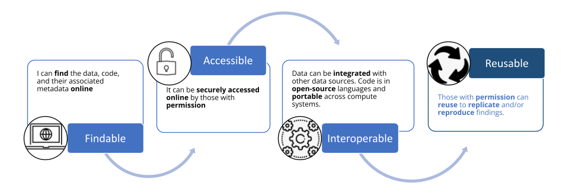
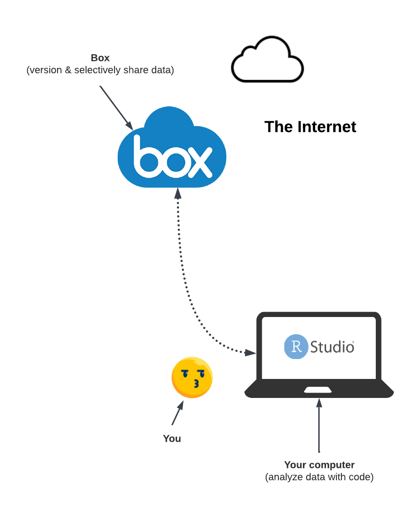
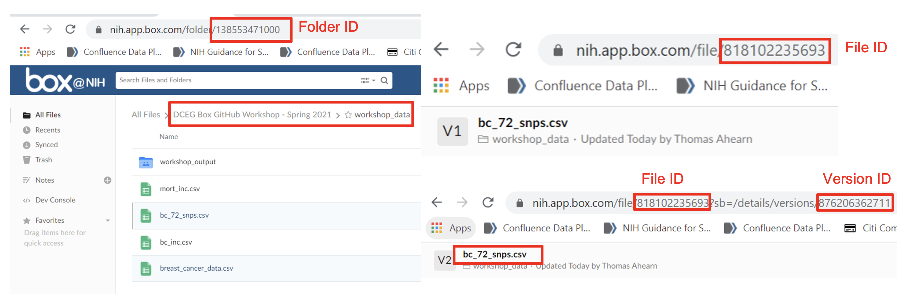
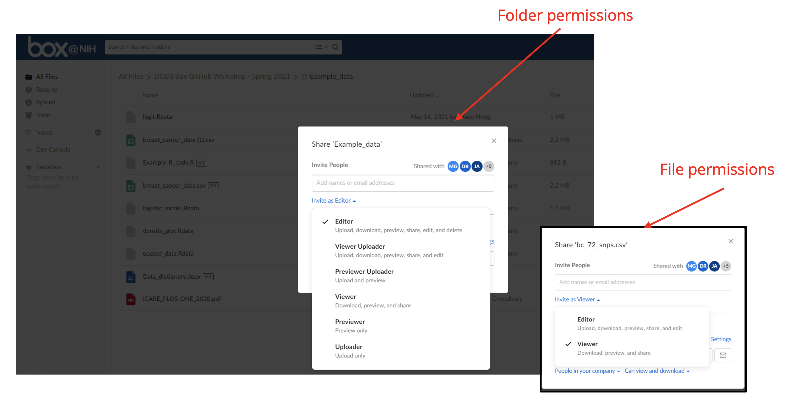
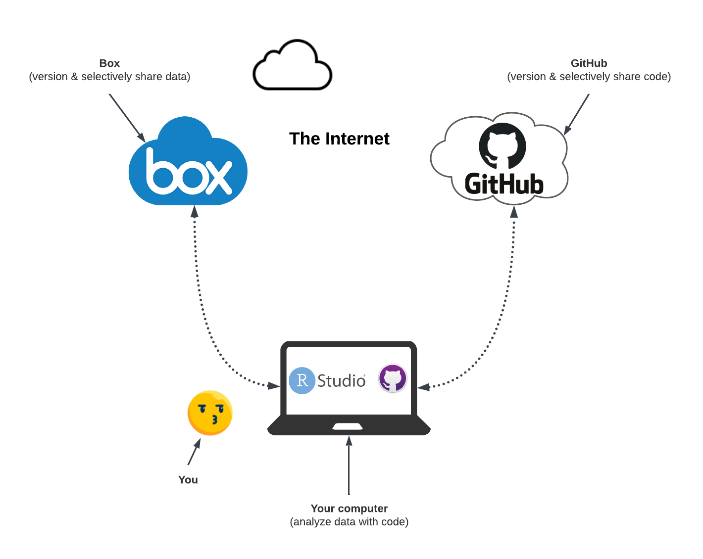
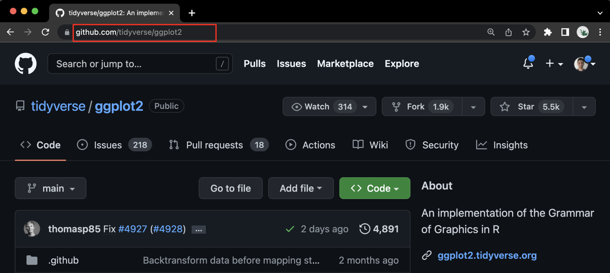
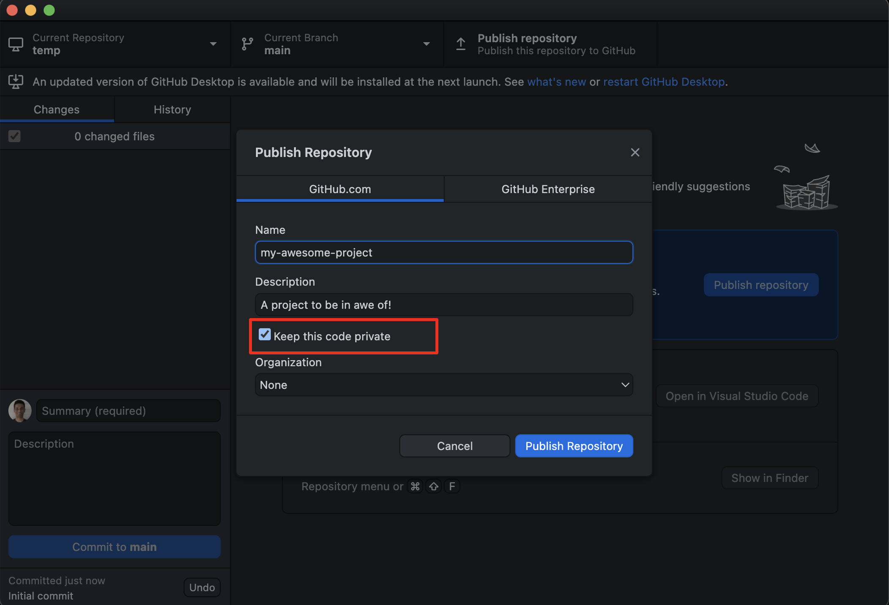

# Lecture slides

<iframe src="https://docs.google.com/presentation/d/e/2PACX-1vQ2m_PajbJCqTp5GnbMw7wYCZUf5ca8ez-sTgTMw5ylyRZEDL7f1uIZs3ltOHvw5mPtBWVIwED_Pyu1/embed" frameborder="0" width="960" height="569" allowfullscreen="true" mozallowfullscreen="true" webkitallowfullscreen="true"></iframe>

# Learning objectives

- Become conversant with the terms Findable, Accessible, Interoperable, and Reusable (FAIR).
- Review how Box helped us adhere to the FAIR principles.
- Learn how Git and GitHub can help us achieve FAIRness.
- Learn about resources within DCEG to review FAIR concepts, and discuss the challenges and opportunities in applying it to your bespoke research setting.

# Lecture notes

## Motivation

There are several motivations to make our research practices more FAIR—

- To make our research resources easy to share and be reused by our target audience (and our selves), with appropriate credits for our contributions.
- To make our research findings reproducible and replicable.
  - *Reproducibility* is the ability to use the same data and the same code that you used, to obtain the same findings that you did.
  - *Replicability* is the ability to use the same code that you used but on a different yet related dataset, to obtain findings that are similar to yours.
- To make it easier to collaborate with others.
- To comply with data sharing policies of funding agencies and scientific journals.

## FAIR principles

  

In the following definitions, *users* can refer to both yourself and others who want to use or extend your work.

- **Findable**: users can locate your research resources (data, code, and the associated metadata) online.
   - This is best achieved when your resources are linked via URLs that are globally unique and persistent identifiers. 
   - Such a resource can then be found remotely on the internet from anywhere in the world.
- **Accessible**: your data and code can be securely accessed online by those users with appropriate permissions.
   - The word *governance* is perhaps more appropriate. Accessibility refers to your ability to govern your resources by controlling who can and who cannot access your resources.
   - You may want to govern each of your research resources differently. For example, you may want to share your code with everyone, but your data may need to be restricted to only those with certain permissions.
- **Interoperable**: users can integrate your data with other data sources and users can run your code on any compute system.
   - Interoperability is achieved by adhering to open standards. 
   - You can use open standard (non-proprietary) formats to describe your data, such as— CSV, JSON, XML, and RDF.
   - You can write code in open-source languages that are supported on a variety of compute systems, such as— R, Python, and JavaScript.
- **Reusable**: users with permission can reuse your resources to reproduce your results and/or replicate your findings.
   - Reusability is achieved by simply ensuring that your resources are Findable, Accessible, and Interoperable.

We shall now see how RStudio, Box, Git, and GitHub helps us adhere to these principles with ease.

## Box

[Box](https://www.box.com/) is a cloud-based file storage service and collaboration platform. It is a great tool to store and share your research data. 

[In the first workshop of the FAIR workshop series](https://dceg-workshops.github.io/fair_principles_for_data_stewardship/workshops/workshop_1), we showed how to incorporate Box within our RStudio work environment as shown in the diagram below. We remotely (from your computer to where Box is located on the internet) communicated with the Box service via [the R library `boxr`](https://cran.r-project.org/web/packages/boxr/vignettes/boxr.html).

  

The `boxr` library is built on top of the Box API. The Box API allows us to interact with Box programmatically. This means that we can write R scripts to upload our data on Box, retrieve it, modify it (while keeping track of all versions of the data), and/or selectively share it with others. We can also revoke access to our data from specific users at any time.

### How does Box help achieve FAIRness?

We achieved FAIRness by using Box to store and share our research data and by using the `boxr` library to interact with Box. Specifically, we achieved FAIRness as follows—

- **Findable**: Box assigns a unique and persistent URL to each data object, and all its versions, stored in Box. Those with permissions can use this URL to access the data object from anywhere in the world. In the first workshop, we were able to access a specific data object stored in Box using the unique URL associated with it from RStudio via `boxr`.

  

- **Accessible**: Box allows directory owners to control who can access their data objects. We can share our data objects with specific users, a group of users, or the entire world. We can also revoke access to our data objects from specific users at any time. We can grant users granular permissions to our data objects. For example, we can grant some users the ability to view our data objects, but not to modify them. In the first workshop, we used `boxr` to access only those files from Box that each of us had permissions for.

  

- **Interoperable**: the data objects we store in Box should be in open standard formats, such as— CSV, JSON, XML, and RDF. We must not store the data objects in proprietary formats, such as— Microsoft Excel, Microsoft Word, or Adobe PDF— which would require the users to have the necessary license and specialized tools to read these formats. This creates a hurdle in interoperability because the users do not have a straightforward way to combine your data objects with elements from other data.
- **Reusable**: by ensuring that our data objects are Findable, Accessible, and Interoperable using Box, we ensured that our data objects are Reusable. This is because the users can now easily locate, access, and integrate our data objects with other data objects. This allows them to reproduce our results and/or replicate our findings.

## Git & GitHub

Let us start by distinguishing Git from GitHub.

### Git

[Git](https://git-scm.com/) is a *local*, *version control system* software.

*Local* implies that the Git software exists within your computer. This can be any device you use for computing, for example— your NIH laptop, a Biowulf node, or a cloud virtual machine. You can download Git from [here](https://git-scm.com/downloads). In many Unix-based systems (e.g., Linux and Mac), Git comes pre-installed.

A *version control system* is a software that helps you keep track of the changes you make to your files in a directory. It is a great tool to keep track of the changes you make to your code.

There are multiple ways to access the Git software in your computer—
- The command line (Terminal for Mac, Command Prompt for Windows).
- A GUI (Graphical User Interface) software, such as— [GitKraken](https://www.gitkraken.com/), [GitHub Desktop](https://desktop.github.com/), or [SourceTree](https://www.sourcetreeapp.com/).
- An RStudio add-in. [See instructions here](https://happygitwithr.com/index.html).

For this workshop, we will use [GitHub Desktop](https://desktop.github.com/) to access the Git software in our computers. This is a GUI software developed by GitHub. Compared to the RStudio add-in, GitHub Desktop is more user-friendly and easier to use. Once you are comfortable using GitHub Desktop, you can switch to the RStudio add-in.

### GitHub

[GitHub](https://github.com/) is a *collaborative networking* website that provides a service to *remotely* *host* and manage copies of your project directories. 

*Remote* implies that the GitHub website exists on the internet. You can access it from your computer either via a web browser or via the GitHub Desktop software.

*Collaborative networking* means that you can share your project directories with other users (or store it for yourself to re-visit it in the future). This allows you to collaborate with other users. You can also share your project directories with the world. This allows other users to access your project directories and use them for their own projects. When you publish a paper, GitHub has become the de-facto standard platform for sharing the code used to generate the results in the paper.

*Hosting service* is a service to remotely store copies of your project directories. This allows you to access your project directories from anywhere in the world. You can access your project directories from your computer, from a cloud virtual machine, or from a Biowulf node.

There are other alternatives to GitHub, such as— [GitLab](https://about.gitlab.com/), [BitBucket](https://bitbucket.org/), and [SourceForge](https://sourceforge.net/). However, GitHub is the most popular and widely used platform for hosting your project directories. Once you are familiar with GitHub, you will become comfortable using these other platforms as well.

### Integrating GitHub into our workflow

In this workshop, we will integrate GitHub with our existing RStudio-Box workflow from the first workshop, as shown in the diagram below. We will store our research code on GitHub by remotely communicating with the GitHub service via the GitHub Desktop software. Here, GitHub Desktop assumes a similar role to `boxr`, used to communicate with Box, in the first workshop.

  

This setup can be considered as a minimalistic *data commons*. [Data commons "co-locates data with cloud computing infrastructure and commonly used software services, tools & applications for managing, analyzing and sharing data to create an interoperable resource for a research community"](https://medium.com/@rgrossman1/a-proposed-end-to-end-principle-for-data-commons-5872f2fa8a47). In our version of the data commons, we bring our own compute (e.g. our laptop). Both the data and the code exists in the cloud, thanks to Box and GitHub.

We can immediately see the benefits of this setup. It gives us a flexible framework to plug-and-play with different datasets, while evaluating the same code (i.e. *replicating* studies). It also allows us to plug-and-play with different code solutions for the same problem (i.e. *benchmarking*). For *reproducing* a specific study, we simply need to locate and access a specific data object from Box and the specific code from GitHub.

### How does Git & GitHub help achieve FAIRness?

Git & GitHub help us achieve FAIRness in the following ways—

- **Findable**: GitHub assigns a unique and persistent URL for each software source code (and its versions) that we store there. Both the code and the metadata is co-located at the URL. This allows us to locate a specific version of our code using the URL associated with it using the browser or via the GitHub Desktop.

  

- **Accessible**: GitHub allows project owners to control who can access our code. We can share our code with specific users, a group of users, or the world. We can also revoke access to our code from specific users at any time. Those with permissions can securely access our code.

  

- **Interoperable**: the software we develop should be written using open-source languages, such as— R, Python, and JavaScript. We must not use proprietary languages, such as— MATLAB, SAS, and Stata— which would require the users to have the necessary license to run our code. Our software development environment should also be open-source, such as— RStudio. RStudio allows the users to run your code on any major operating system— Windows, Mac, and Linux.
- **Reusable**: by ensuring that our code is Findable, Accessible, and Interoperable using GitHub, we ensure that our code is Reusable. This is because the users can now easily locate, access, and run our code. This allows them to reproduce our results and/or replicate our findings.

## Conclusion

  

## Additional resources
1. [García-Closas, Montserrat, et al. "Moving towards FAIR practices in epidemiological research." arXiv preprint arXiv:2206.06159 (2022).](https://arxiv.org/abs/2206.06159)
2. [YouTube series introducing Git and GitHub to absolute beginners](https://www.youtube.com/playlist?list=PLRqwX-V7Uu6ZF9C0YMKuns9sLDzK6zoiV).
3. [Git's official web book introducing Git and GitHub](https://git-scm.com/book/en/v2)
4. [GitHub's official guide to using Git and GitHub](https://docs.github.com/en/get-started/quickstart/set-up-git).
5. [GitHub's official guide to using GitHub Desktop](https://docs.github.com/en/desktop/installing-and-configuring-github-desktop/installing-and-authenticating-to-github-desktop).
6. [A web book introducing Git and GitHub to RStudio users](https://happygitwithr.com/).

