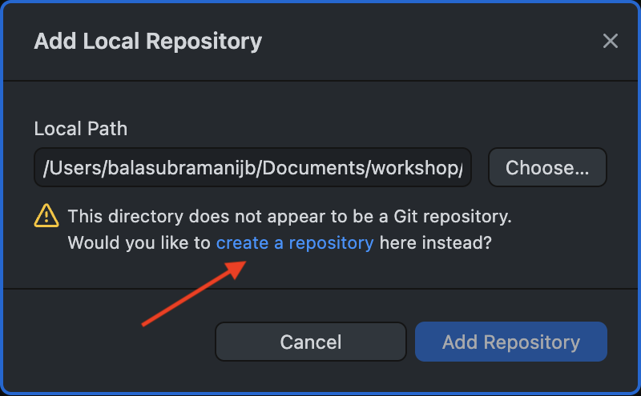
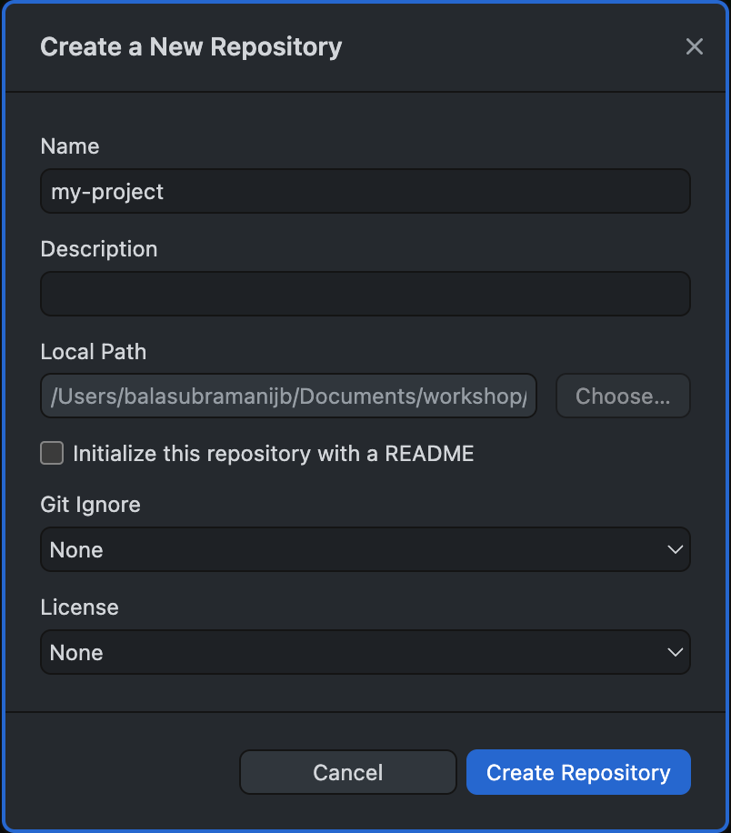
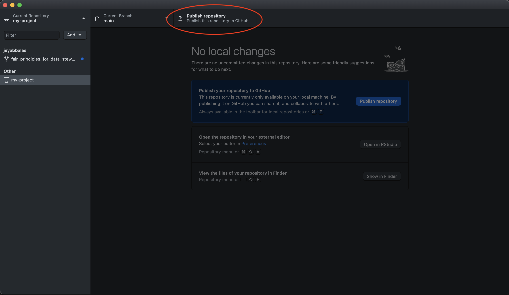

<script link="{{ site.baseurl }}/assets/js/vanilla-back-to-top.min.js"></script>
<script>addBackToTop()</script>


## Practicum overview

Welcome to the practicum section of the "Introduction to GitHub" workshop!

As a researcher and a programmer you wear several hats. You are a—
- **Creator**: you solve research problems, and provide these solutions to the public.
- **Consumer**: you use other people's code to either reproduce or replicate their findings.
- **Contributor**: you contribute to the code of others by adding new features, fixing bugs, or improving their documentation.
- **Project manager**: you manage the development of a software project that includes your own code, and the code from others (your team, your collaborators, and open source contributors from the public).

For each role, Git & GitHub provides you with a specialized set of tools to help you better achieve your goals. In this practicum, you will learn how to use Git & GitHub to play the role of a _Creator_ and a _Consumer_. If you scroll further down this document, we show you how to also play the roles of a _Contributor_ and a _Project manager_. 

The figure below summarizes the task ahead. 

<div style="display: flex; justify-content: center">
  
</div>

As a _creator_, you will create a local directory for a project in your computer. This can either be an empty directory for a new project or a directory of an existing project that you have already been working on. We will then create a copy of this project remotely on GitHub. This step will instantly make our work significantly FAIRer, and we shall see how. You will then continue to make changes to the project files locally as you always do but then also update these changes to the remote copy of your project on GitHub. 

As a _consumer_, you will _clone_ (similar to a download but empowered with Git features) a remote copy of a project that you like to your computer. You will then run the cloned code locally in your computer.

As you walk through this practicum, please pay a special attention to how each of these steps help you achieve FAIRness.

## Creator workflow

When playing the role of a creator, researchers solve a problem of scientific interest and provide the solution to the public. This solution is typically in form of a scientific publication along with a software package, and some data for demonstration and easy verification.

The following steps are the typical workflow of a creator—
1. Create a local directory for the project.
2. Create a remote copy of the project on GitHub.
3. Make changes to the project files as you solve the various sub-problems that contribute towards solving the overall problem. While doing so, keep both the local and remote copies of your code in sync.

Let us now walk through each of these steps in detail.

### Step 1: Create a local Git repository


#### Create a local directory
For this practicum, please create a new directory on your computer (i.e. a _local_ directory). You can name it anything you like. For example, you can name it `my-project`. We recommend that you use the [kebab-case](https://www.freecodecamp.org/news/programming-naming-conventions-explained/) for naming your project directories. This is because kebab-case is the most common naming convention for software packages in the world. They come from the Unix world, and are commonly used by the R, Python, and JavaScript programming communities to distribute software.

**Note**: outside of this workshop, in the real-world use case, you may already have some project directories in your computer that you are looking to make FAIRer. It could be a project that you are currently working on or a project that you worked on in the past. In this case, instead of creating a new directory, you can start with that directory. For this workshop, we will assume that you are starting with a new directory.

**<span style="color: red;">!! WARNING !!</span>**: never put anything sensitive in the directory that you plan to put on GitHub. This is not a good coding practice! Sensitive information includes research data that your data sharing policy forbids from sharing with the public, API keys, authentication tokens, and SSH keys. Anything that you cannot share with the public. When you are looking to move an existing project directory into GitHub in order to make it FAIRer, <u>please remove all sensitive information from this directory before you proceed to the next step</u>. Despite GitHub offering private repositories, coding repositories are not the place to put such information. For research data, in accordance with the data sharing policy, please use Box.com and access it from your code via the [`boxr` package](https://cran.r-project.org/web/packages/boxr/vignettes/boxr.html). Despite you sharing this code with the public, only those users with permissions will be able to ingest the data in Box. If the data sharing policy forbids using Box, create a separate directory in your computer, away from your Git repositories, for your data. For API keys, please use environment variables. For authentication tokens and SSH keys, please use a password manager. 

#### Initialize the local directory as a Git repository
Your empty project directory is not yet a Git repository i.e., the Git software in your computer is not currently tracking all the changes that will be made in this directory. 

To ask the Git software to track changes in this directory, open GitHub Desktop. Select `File > Add Local Repository...`. Click `Choose...` and locate your project directory. Alternatively, you can simply drag-and-drop your project directory into the GitHub Desktop window. Don't click anything yet and simply observe the message on GitHub Desktop. You will see a window that looks like this—

<div style="display: flex; justify-content: center">
  
</div>

The pop-up says "This directory does not appear to be a Git repository, Would you like to `create a repository` here instead?". If you dragged in a directory that was already a Git repository, you should not receive this message. Click the link `create a repository`. You should see a new pop-up window that looks like this—

<div style="display: flex; justify-content: center">
  
</div>

Fill the information as follows—
- **Name**: the name of your project. It should be pre-populated with the name of the directory you just created. For example, `my-project`.
- **Description**: a short description of your project. This is optional but recommended.
- **Local Path**: the path to your project directory. This should be also pre-populated with the path to your project directory. For example, `/Users/username/my-project`.
- **☑ Initialize this repository with a README**: keep this option checked. This will create a `README.md` file in your project directory. This file is a standard file that is used to describe the project. This is the first file that the users of your code will see. This file should contain all information required to correctly run your code. You can read more about it [here](https://docs.github.com/en/github/creating-cloning-and-archiving-repositories/about-readmes). 
  - This step is our first encounter with GitHub's adherence towards FAIR principles. The `README.md` file is a type of metadata associated with code. GitHub offers to create this file automatically for you.
- **Git Ignore**: This file is a standard file that is used to tell Git which files to ignore. This is useful because you may have some files in your project directory that you do not want Git to track. For example, you may have some large files that you do not want to upload to GitHub. You can read more about it [here](https://docs.github.com/en/github/using-git/ignoring-files).
  - Click the drop-down box and select the main programming language that you plan to develop your source code in. For this workshop, we will select `R`. This will automatically populate the `Git Ignore` file with the standard set of files that you typically do not want to track in your Git repository. For example, it will ignore all files with the extension `.RData` and `.Rhistory`.
  - **<span style="color: red;">!! WARNING !!</span>**: again, please do not use this file to ignore sensitive files. Sensitive files should not be in your Git repository in the first place. Please read the warning message in the previous subsection for more details. Git ignore is only for extraneous files that are not necessary for users to run your code.
- **License**: This is a standard file that is used to describe the license under which your code is released. This is important because it tells the users of your code how they can use your code. For example, you may want to release your code under the [MIT license](https://opensource.org/licenses/MIT) which allows the users to use your code for any purpose, including commercial purposes. You can read more about it [here](https://docs.github.com/en/github/creating-cloning-and-archiving-repositories/licensing-a-repository). To learn about other open source license options, click [here](https://choosealicense.com/).
  - The choice here mainly depends upon the data sharing policy of your project. Please consult with your supervisor to determine the appropriate license for your project.
  - **Note**: failure to specify a license defaults your project to a very restrictive license. Users are not free to do anything with your code without fear of litigation. This would discourage researchers and developers from using or improving your code. Such projects usually don't gain any traction within the developer community and are often doomed from the beginning. So, please spend some time and specify a license.
  - For this workshop, we will select the `MIT License`. This will automatically populate the `LICENSE` file with the standard text of the MIT license. Click the drop-down box and select the license that you plan to release your code under. The `MIT License` is a good permissive default license when you are free to choose your own license.
  - This step is our second encounter with GitHub's adherence towards FAIR principles. Specifying a license improves the _Findability_ (code metadata is co-located with the code), _Accessibility_ (the `LICENSE` file is used to govern how others can use your code), and _Interoperability_ (open source licenses do not create a licensing hurdle for your users and allows them to build upon your work) of your code.

The populated window should look like this—

<div style="display: flex; justify-content: center">
  
</div>

Click `Create Repository`. The GitHub Desktop window should now look like this—

<div style="display: flex; justify-content: center">
  
</div>

If you go to your project directory, you will see that two new files were created— `README.md` and `LICENSE`. A hidden file, `.gitignore`, is created that will keep a list of all the files to not track by Git. You can open these files in a text editor to see their contents.

You have now created a local git repository. This means that the Git software in your computer is now tracking all the changes that will be made in this directory.

<div style="display: flex; justify-content: center">
  
</div>

### Step 2: Create a remote copy of your local Git repository

In this step, we will upload a copy of your local Git repository to the GitHub servers. This will create a remote copy of your local Git repository. This remote copy will make your code locatable and accessible, from anywhere in the world, by those with appropriate permissions and an internet access. It can be used to share your code with the world.

To do this, click on the `Publish Repository` button in the top-right corner of the GitHub Desktop window. See the button circled in red.

<div style="display: flex; justify-content: center">
  
</div>

This will open a new pop-up window that looks like this—

<div style="display: flex; justify-content: center">
  
</div>

The window is pre-populated for the project `Name` and `Description`. Additionally, it gives us an option: `☑ Keep this code private`. You can check the box to keep your repository _Private_. If you choose to do so, only you will have access to your code on GitHub. You can choose to add a few collaborators later. If you do that, only you and your collaborators will have access to the code. You can later choose to make the repository _Public_, when you are ready. For this workshop, let us remove the check mark from the box, implying that we want our code repository to be _Public_. You can select a GitHub `Organization` that you may be part of in case your project is a repository in that organization. Please review the lecture notes if you are unfamiliar with GitHub organizations. Click `Publish Repository`.

The pop-up window should now look like this—

<div style="display: flex; justify-content: center">
  
</div>

Notice how the `Publish Repository` button in the top-right corner of your window has now changed to `Fetch origin`. 

Please go to https://github.com/ on your web browser, log into your account, and verify if the remote repository has indeed been created. In the GitHub website, you can do so by clicking on your profile icon in the top-right corner of the website, then click on `Your repositories`. My GitHub page looks like this—

<div style="display: flex; justify-content: center">
  
</div>

You should see a repository with the name that you specified in the previous step. Click on the repository to open it. You should see a page that looks like this—

<div style="display: flex; justify-content: center">
  
</div>

Click the project and take a look at the project page designed by GitHub. You should see a page that looks like this—

<div style="display: flex; justify-content: center">
  
</div>

This is the remote copy of your local Git repository. Notice the URL assigned by GitHub to your page. It would be of the form: `https://github.com/your-username/your-project-directory-name`. This is a key idea with respect to _Findability_ aspect of the FAIR principles. This persistent and unique URL assigned by GitHub to your project makes it locatable by anyone with permissions.  You can now share this link with your collaborators and other users. They can use this link to _clone_ your repository i.e., make their own local copies of your code to run it or possibly build upon it for collaborative software development.

Also, note in the bottom of the GitHub project page, you can see the `README.md` file is co-located with the source code from the same URL. This again improves the _Findability_ of your code. All information that the users need to run your code would be contained in this `README.md` file.

You have now created a remote copy of your local git repository on GitHub.

<div style="display: flex; justify-content: center">
  
</div>

### Step 3: the Git workflow

#### Creating an R virtual environment

Open RStudio. Select `File > Open Project`. Navigate to the local project directory that we created in step 1. Select the project directory and click `Open`. This will open the project in RStudio. This step would also create R's virtual environment `.Rproj` file in the project directory. This file is used to keep track of the R packages that are used in the project. 

In our example so far, RStudio automatically created the `my-project.Rproj` file in our project directory. This object creation represents a change that has occurred in our project directory. This change is reflected in the GitHub Desktop window. The `Changes` tab in the GitHub Desktop window should now look like this—

<div style="display: flex; justify-content: center">
  
</div>

The green plus sign next to the R project file in the `Changes` tab indicates that the nature of the change is the _addition_ of a new file to the project directory. Let us ask GitHub Desktop to track this change. In the bottom-left corner of the GitHub Desktop window, you will see a `Commit` box. Type in a short message that describes the change that has occurred. In our example, we will type in "Create R project file". This message is called a _commit message_. It is a short message that describes the change that is used to keep track of the changes that you have made in your project directory. Click on the `Commit to main` button. This will `commit` the change to the local Git repository i.e., the local Git software will take a snapshot of this change. This is similar to saving a text file after making some edits. The GitHub Desktop window should now look like this—

<div style="display: flex; justify-content: center">
  
</div>

Notice how the `Fetch origin` button on the top menu has now changed to `Push origin`. Click on the `Push origin` button. This will `push` the changes to the remote copy of the local Git repository on GitHub. This means that it will synchronize the changes to the remote copy of your project. Once your click the `Push origin`, the button will revert back to `Fetch origin`. Go to the GitHub website to verify if the changes have been pushed to the remote copy of your project. You should see a page that looks like this—

<div style="display: flex; justify-content: center">
  
</div>

**Git workflow**: congratulations, you have just performed a git workflow! This sequence of steps is by far the most common workflow that you will use when you are working on a project with Git & GitHub. You will make changes to your project directory (editing), `commit` the changes to the local Git repository (asking local Git software to remember the changes), and then `push` the changes to the remote copy of your local Git repository (asking GitHub to synchronize the changes with your local Git software). This is the workflow that you will use to keep track of your changes and to share your code with your collaborators.

#### Editing the license file

When we set up the Git repository, we used a good, permissive default license called the `MIT License`. GitHub Desktop automatically populated the `LICENSE` file with the standard text of the MIT license. The National Cancer Institute advices that pieces of software developed within DCEG by a federal employee should not be copyrighted. This is because the federal government owns the copyright of the work produced by its employees. So, if you are developing a software as a federal employee, please modify the text in your `LICENSE` file to reflect this i.e., please delete the line that says "Copyright (c) 2022 Your Name". 

To edit this file, go to RStudio. In the bottom-right corner of the RStudio window, you will see a `Files` tab. Click on the `Files` tab. This will open the `Files` pane. In the `Files` pane, you will see the `LICENSE` file. Click on the `LICENSE` file to open it. This will open the `LICENSE` file in the `Editor` pane. In the `Editor` pane, you will see the text of the `LICENSE` file. Delete the line that says "Copyright (c) 2022 Your Name". The `Editor` pane should now look like this—

<div style="display: flex; justify-content: center">
  
</div>

We have just made our second significant change to our project directory. Follow the steps in the Git workflow as before. Observe the change in the `Changes` tab in the GitHub Desktop window. The yellow dot symbol next to the `LICENSE` file in the `Changes` tab indicates that the nature of the change is the _modification_ of an existing file in the project directory. 

Let us ask the local Git software to remember the change by using `commit`. In the bottom-left corner of the GitHub Desktop window, type in a short message that describes the change that has occurred. In our example, we will type in "Update license". Click on the `Commit to main` button. This will `commit` the change to the local Git repository.

Let us synchronize the new change with the remote repository. Click on the `Push origin` button. This will `push` the changes to the remote copy of the local Git repository on GitHub. 

You have just completed the Git workflow for the second time. Go to the GitHub website to verify if the changes have been pushed to the remote copy of your project.

#### Working as usual

Now that you have gotten the hang of things, let us work as usual.

Create a new file within your project directory. This will be an R script. You can name anything you like, for example, `exploratory_data_analysis.R`. Copy the code below and paste it in the R script that you just created. Save the file.

```r
###########################
# SETUP
###########################
# Install "boxr", if you don't have it installed already. Load the boxr package. 
#
# boxr library establishes a communication ( allows you to read/write files that
# you have access to) from your local (e.g., in your laptop) RStudio and your 
# remotely located (on the cloud) Box.com storage space.

install.packages("boxr")
library(boxr)

####################################
# AUTHENTICATION
####################################
# Authentication is the process of providing permission to your RStudio tool to
# access your Box.com account, on your behalf.
# If you are not already logged into Box after running this code, you may be
# asked to log into Box. Identify Box as your hard disk in the cloud.

box_auth(client_id = "627lww8un9twnoa8f9rjvldf7kb56q1m",
         client_secret = "gSKdYKLd65aQpZGrq9x4QVUNnn5C8qqm") 

   # Set the working directory to the "DCEG GitHub_RStudio_FAIR Workshop" 
   # Box folder using the folder ID
box_setwd(dir_id = )

####################################
# READ IN FILES
####################################
# box_read reads the file into local memory - see the console after running the 
# code for the temporary file path. After closing your RStudio session the 
# file/data is deleted from the temporary local memory.

      # NOTE: The file ID is needed to read in the bc_data.csv file

bc_data = box_read(file_id = )

###################################
#### EXPLORATORY DATA ANALYSIS ####
###################################

# Work as always

plot_variable = "BMI" # change here
n_bins = 50

hist(bc_data[bc_data[["status"]]==1, plot_variable], 
     breaks=n_bins, prob=TRUE, 
     col=rgb(1, 0, 0, 0.5), 
     main=paste0("Distribution of ", plot_variable), 
     xlab=plot_variable)
lines(density(bc_data[bc_data[["status"]]==1, plot_variable]), 
      col="red", lwd=2)

hist(bc_data[bc_data[["status"]]==0, plot_variable], 
     breaks=n_bins, prob=TRUE,
     col=rgb(0, 0, 1, 0.5), 
     add=TRUE)
lines(density(bc_data[bc_data[["status"]]==0, plot_variable]), 
      col="blue", lwd=2)

legend("topright", 
       title="status",
       legend=c("Case","Control"), 
       col=c(rgb(1,0,0,0.5), 
             rgb(0,0,1,0.5)), 
       pt.cex=1, 
       cex=0.3, 
       pch=15 )

```

Execute the commands in the script. Let us take a closer look at what each line of code does.

#### FAIR data

In the initial few lines, we get to review some concepts from the first workshop.

The code below installs the `boxr` package if you don't have it installed already. It then loads the `boxr` package. Recollect from the first workshop. We use `boxr` to communicate with Box. This is similar to GitHub Desktop, which is communicating with GitHub on our behalf.

```r
install.packages("boxr")
library(boxr)
```

The code below authenticates your RStudio with your Box account. If you are not already logged into Box after running this code, you may be asked to log into Box. Identify Box as your hard disk in the cloud.

```r
box_auth(client_id = "627lww8un9twnoa8f9rjvldf7kb56q1m",
         client_secret = "gSKdYKLd65aQpZGrq9x4QVUNnn5C8qqm") 
```
There are a few things to note about `client_id` and `client_secret`—
- The terms `client_id` and `client_secret` may cause you some anxiety. Secrets are not supposed to be shared. Don't worry, you are free to share `client_id` and `client_secret` with anyone. They are not secrets. They are just identifiers that are used to locate Box.com web servers on the internet. Think of them as the address to the gate-keepers of Box. Only those with a Box account are let in. That is why you were asked to log-in. Those without an account are turned away.
- If you share the `client_id` and `client_secret` with someone, they won't magically gain access to your data. They will only have access to the data that they are given access to via Box's website.
- The `client_id` and `client_secret` remains the same for any project that involves data in Box. Again, it is merely the address to the gate-keepers of Box. It is not the address to your data. So, feel free to re-use this code snippet for other projects that involves data in Box.


## Consumer workflow

### Adding collaborators


### Step 1: Clone a remote Git repository


### Git issues


## Advanced concepts in GitHub

## Contributor workflow

### Step 1: Fork a remote repository

### Step 2: Clone a remote repository

### Step 3: Create a new branch

### Step 4: the Git workflow

### Step 5: Create a pull request


## Project manager workflow


### Conflict resolution
